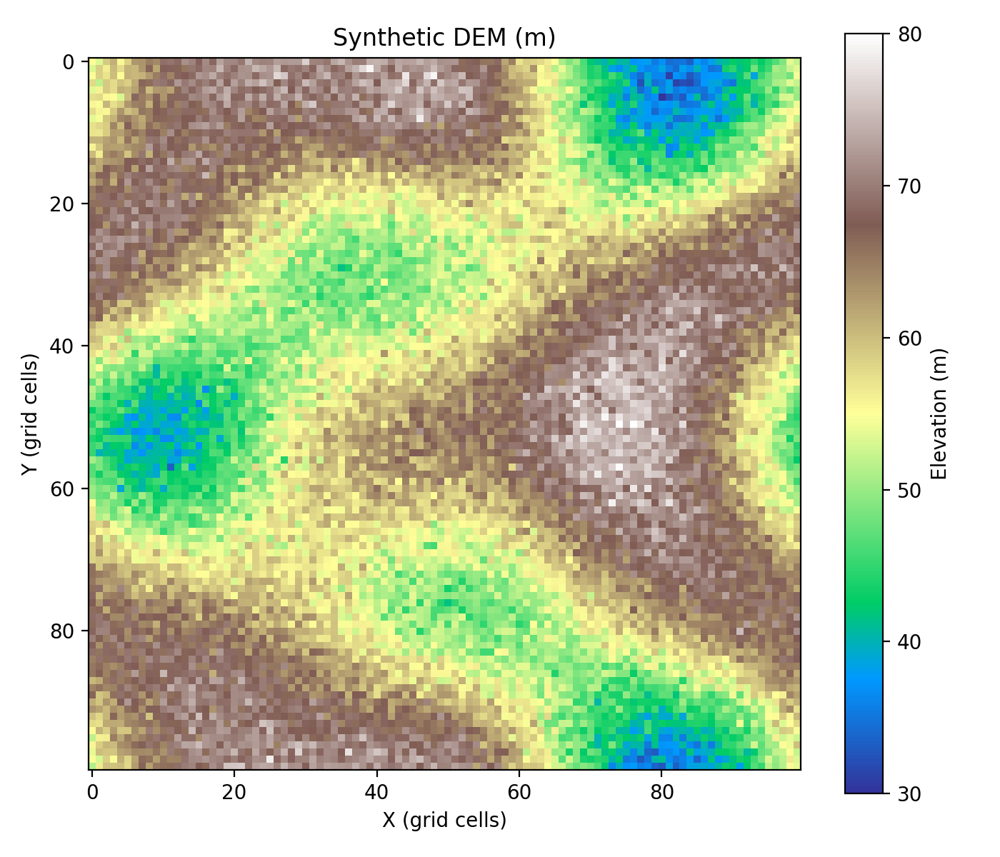

🌊 Flood Inundation Analysis

> Experiment 1 of the Software Development coursework. This module focuses on simulating flood spread over a synthetic Digital Elevation Model (DEM) and analyzing how inundation changes with increasing water levels.

---

A Python-based hydrological simulation tool that models flood inundation over a 2D terrain grid. The system computes which areas become flooded at different water levels and visualizes terrain elevation and flood extent using Matplotlib.

The entire workflow is implemented in a single file: `flood_inundation.py`.

---

 What it does

- Generates a synthetic 100×100 Digital Elevation Model (DEM) stored in `synthetic_dem.npy`
- Represents terrain as a smooth elevation surface (30–80 m range)
- Visualizes terrain using heatmaps (`synthetic_dem_heatmap.png`)
- Simulates flooding using elevation thresholding
- Computes flooded percentage at different water levels
- Creates flood overlay visualization (`flood_overlays.png`)
- Plots flood growth behavior (`flooded_pct_vs_level.png`)

---

## The method

The DEM represents terrain as a grid where each cell contains elevation values.

Flooding is computed using a simple physical rule:

flooded(cell) = elevation < water_level

From this, the system calculates:

flooded_percentage = (flooded_cells / total_cells) × 100

At each water level, the model recalculates flooded regions and tracks how inundation increases over time.
 Key outputs

| File | Description |
|------|-------------|
| `synthetic_dem.npy` | Generated 100×100 elevation grid |
| `synthetic_dem_heatmap.png` | Terrain elevation visualization |
| `flood_overlays.png` | Flooded area overlay on terrain |
| `flooded_pct_vs_level.png` | Flooded percentage vs water level curve |

 Requirements

- Python 3.10+
- NumPy
- Matplotlib

Install dependencies:

bash
pip install -r requirements.txt
Usage

Run the simulation:

python flood_inundation.py

This will:

Load or generate the synthetic DEM
Compute flood extent across multiple water levels
Save all visualization outputs automatically
Project structure
flood_inundation/
├── flood_inundation.py
├── synthetic_dem.npy
├── synthetic_dem_heatmap.png
├── flood_overlays.png
├── flooded_pct_vs_level.png
├── requirements.txt
└── prompt_log.md
Result

The simulation shows a physically consistent trend where flooded area increases monotonically as water level rises, validating the correctness of the model implementation.

